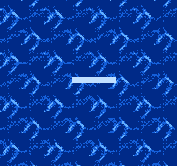

# NES Animated Background Demo



This is as short little ROM demonstrating animated backgrounds on the NES using
the MMC1 mapper with CHR RAM.  The animated image is 8x8 tiles (64x64 pixels)
with three colors that tiles seamlessly across the screen.  A "snake" is
present to demonstrate the redrawing of the correct animation tiles onto the
background.

## Building

You'll need the following pieces of software installed to build:

- Git
- Make
- Go (for go-nes dependency)
- [cc65](https://github.com/cc65/cc65)
- [Aseprite](https://www.aseprite.org/) (optional)

Then it's just three commands:

```
$ git clone --recurse-submodules https://github.com/zorchenhimer/nes-animated-background
$ cd nes-animated-background/
$ make
```

## Aseprite

The background animation was made using Aseprite which a paid program.  The
exported bitmaps have been included in this repository to avoid requiring this
program to build the ROM.  Note that the `make cleanall` command will delete
the bitmaps in the `images/` directory to trigger re-exporting them using
Aseprite.  If this is done in error, simply use git to restore the images: `git
checkout -- images/*.bmp`.
